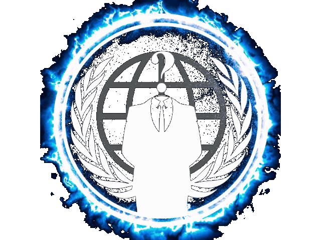

<!-- Anonymous GIF Header -->

  

<!-- Blinking Hacker Text -->

  

# 💫 About Me:
## 👋 Hey, I'm Loki  
🎓 I'm a student of Cyber Science & Technology, passionate about **Ethical Hacking** and **Offensive Security**.  
💻 I forge security tools, uncover vulnerabilities, and dive deep into the art of **Red Teaming** 🚩 with enthusiasm.  

---

### 🧠 What I Do
- 🔍 Bug Hunting | WAPT | VAPT | Cyber Forensics  
- ⚔️ Offensive Tool Development in Python/Bash  
- 🧪 Payload Fuzzing & Exploitation Automation  
- 🤖 OSCP Prep | CTFs | Malware Analysis  
- 🧱 Bypassing WAFs | Evading Detection

- Updating: ON the Journey to became Cybersecurity Specialist.

---

# 💻 Tech Stack:

---

# 📊 GitHub Stats:

 
 

---

<!-- Proudly created with GPRM ( https://gprm.itsvg.in ) -->
